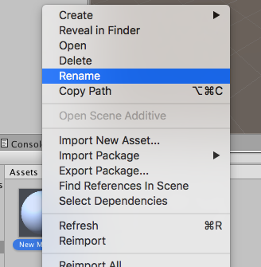

## Adding Colour

+ Create a new folder by clicking **Assets > Create > Folder**. Call it `Materials`.

+ Now make two **materials** (**Assets > Create > Material**) called `EyeBlack` and `NoseRed`.

+ The two new materials should be in the "Materials" folder you just made, in the "Project" pane at the bottom of the screen. If they are not there, drag them onto the the "Materials" folder to place them inside it.

--- collapse ---
---
title: Renaming things
---

You can change the name of a material or a folder by right clicking it and selecting **Rename**.

--- /collapse ---

+ You can set the colour of a material by changing its **albedo** value in the **inspector**. Click on the rectangle next to the dropper icon and a colour picker should open.

+ Make EyeBlack’s albedo value black and NoseRed’s albedo value red.

+ With the Shades object selected, look at the **Mesh Renderer** section of the **inspector** and expand the **Materials** subsection. Click on the small circle to the right of ‘Element 0’ and select EyeBlack. Now we have black shades!

+ Do the same for the Nose object as you did for the Shades object, only now select the NoseRed material. Now we have a red nose!

MazeRobo needs a Rigidbody component that we can use to move her about and interact with the physical world.

+ With MazeRobo selected, click on **Component > Physics > Rigidbody**. 

+ You'll see now that when you have MazeRobo selected there's a **Rigidbody** section in the **inspector**. Open up the **Constraints** subsection of the **Rigidbody** section and set **Freeze Rotation X, Y and Z** to **True** by ticking all the boxes. In **Freeze Position**, set **Y** to **True** by ticking that box.

+ Now you have a robot. You can really make it your robot by changing a few colours around, or maybe adding extra pieces to it using more **3DObjects** and moving them around like you did on the last step! Once you're happy with the robot, move on to the next step.
